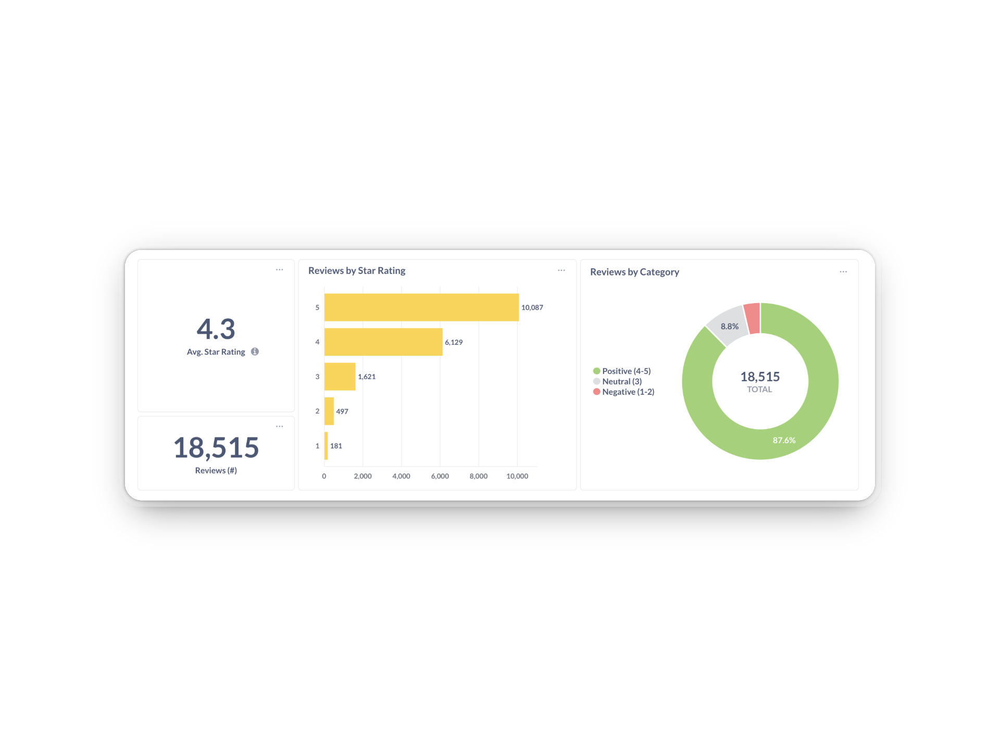

# Metabase Project: Customer Sentiment Analysis Dashboard

## 📖 Overview
Providing a comprehensive view of reviews to uncover patterns in satisfaction, motivations and frustrations, with a focus on subjectivity to helps separate between factual and opinion-driven sentiment.



## 📁 Data Model

To download directly from [Kaggle](https://www.kaggle.com/datasets/thedevastator/booking-com-hotel-reviews/data) → `hotels_reviews.csv` 

| Column            | Type        | Description                          |
|------------------|------------|--------------------------------------|
| index             | integer    | Unique identifier for each review    |
| review_title      | text       | Title of the review                  |
| reviewed_at       | datetime   | Date when the review was written     |
| reviewed_by       | text       | Name of the reviewer                 |
| images            | list/url   | Images attached to the review        |
| crawled_at        | datetime   | Date when the review was crawled     |
| url               | url        | Link to the review                   |
| hotel_name        | text       | Name of the hotel                     |
| hotel_url         | url        | Link to the hotel                     |
| avg_rating        | float      | Average rating of the hotel          |
| nationality       | text       | Nationality of the reviewer          |
| rating            | integer    | Rating given by the reviewer         |
| review_text       | text       | Cleaned review text                  |
| raw_review_text   | text       | Original review text                  |
| tags              | list/text  | Tags or keywords from the review     |
| meta              | json/text  | Additional metadata                   |


## 🧹 Data Cleaning

**1. Split the array** into multiple parts using a separator
```sql
, string_to_array(raw_review_text, ',<p') as array_split
```

**2. Turn them into a set of rows**:
```sql
, unnest(array_split) as array_row
```
**3. Extract the reviews from the text part**:
```sql
, regexp_matches(part, '<svg[^>]*aria-label="([^"]+)"', 'g') as sentiment
, regexp_matches(part, '<span itemprop="reviewBody">([^<]+)</span>', 'g') AS sentiment_review
```

**4. Generated new columns** (each customer's review can have a positive and negative part as well)
| index | reviewer | ... | sentiment | sentiment_review |
|-------|---------|-----|-----------|-----------------|
| 4     | Sue   | ... | Positive  |"The view was great, the apartment furnished in a modern style and equipped with everything you may need. The apartment was clean. There is free, secure parking outside in the building’s parking lot or downstairs in the garage. Jan always responded promptly to all messages sent via Booking.com messenger.  " |
| 4     | Sue     | ... | Negative   | "The building itself has a very musty smell in the hallway (despite being built in 1988), but the apartment itself smells good, which makes it bearable. When showering, the hot water goes off every 2-3 minutes for about 20-30 seconds and then only cold water comes out. The hot water then comes back again. This should be checked out. That is the only thing we didn’t like about the apartment. " | 


## 📊 Dashboard 

#### KPIs (Customer Experience Report)
1. **Average Star Rating →** 4.3 / 5
2. **Reviews (#) →** 18,515
3. **Positive Reviews (%) →** 87.6%
4. **Neutral Reviews (%) →** 8.8%
5. **Negative Reviews (%) →** 3.6%

#### KPIs (Customer Sentiment Report)
1. **Average Customer Score →** 0.8 (from -1 to 1; VADER Sentiment Analyzer)
2. **Average Customer Subjectivity →** (from 0 to 1; TextLob Text Processing) 

## 📈 Key Learnings:
- Customer Experience is positive overall accross all hotels and amenities.
- More reviews are clustered at higher ratings (4★ and 5★), which strengthen customers are generally satisfied.
- Reviews at extreme rating (0★, 3★, 4★ or 5★) often have higher subjectivity, reflecting more emotions (really good or bad experience).
- Middle ratings (1★, 2★) have more moderate subjectivity score, suggesting factual complaints and personal perceptions.
- **Customers writting highly subjective reviews are expressing personal feelings, not just facts.**

## 📚 Python Libraries 
- **VADER**: sentiment analyzer that scores text on polarity, giving values from -1 (very negative) to 1 (very positive). It’s optimized for social media and short text.
  - `customer_score`: overall sentiment score normalized between -1 (most negative) and +1 (most positive).
- **TextBlob**: text processing. One of its features is subjectivity analysis, which scores how subjective or opinionated a piece of text is, from 0 (completely objective) to 1 (completely subjective). TextBlob also has a sentiment analyzer, but in your example, you’re using it for subjectivity.
  - `customer_subjectivity`: measures how subjective or opinion-based a text is (0 (completely objective) to 1 (completely subjective)).

## 🛠️ Technology Stack
- Metabase, PostgreSQL, Python, Docker, VS Code , Github

## ℹ️ Data Source
[Kaggle](https://www.kaggle.com/datasets/thedevastator/booking-com-hotel-reviews?resource=download)

## 👨‍💻 Author
**Jacques Hervochon** 

🟦 [LinkedIn](https://www.linkedin.com/in/jacques-hervochon-27448898) |
🔗 [Portfolio](https://jacqueshervochon.carrd.co/#) |
📆 [Book a call](https://calendly.com/jacqueshervochon/30min)

## 📄 License 
This project is licensed under the MIT License.


