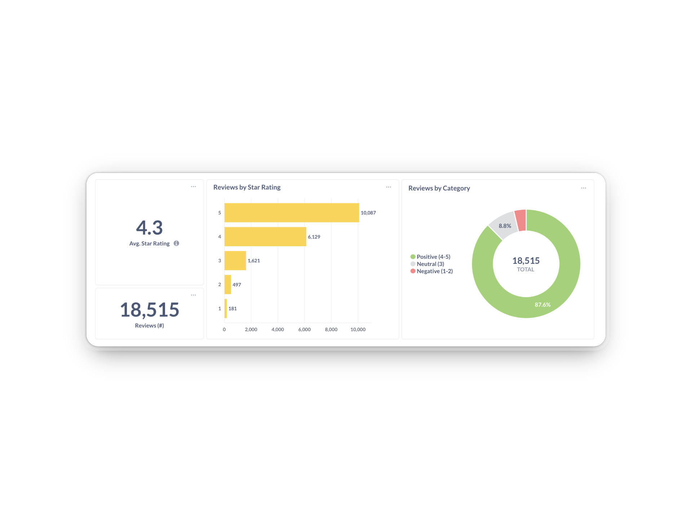

# Metabase Project: Customer Sentiment Analysis Dashboard

### 📖 Overview
Providing a comprehensive view of reviews to uncover patterns in satisfaction, motivations and frustrations, with a focus on subjectivity to helps separate between factual and opinion-driven sentiment.

### 🛠️ Technology Stack
- **Docker →** for running Metabase locally or on a server (open-source)
- **VS Code →** for writting Python scripts to connect to data sources
- **PostgreSQL →** for storing and manipulating data
- **Python →** for performing statistical analysis
- **Metabase →** for creating interactive dashboards and analyzing data
- **Github →** for hosting and sharing portfolio projects
